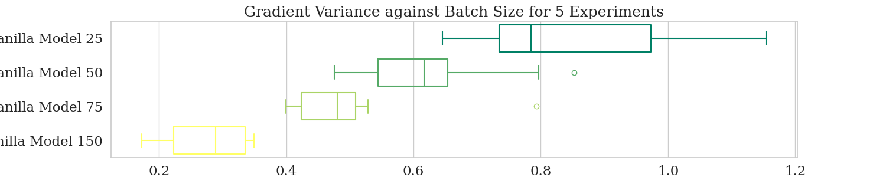
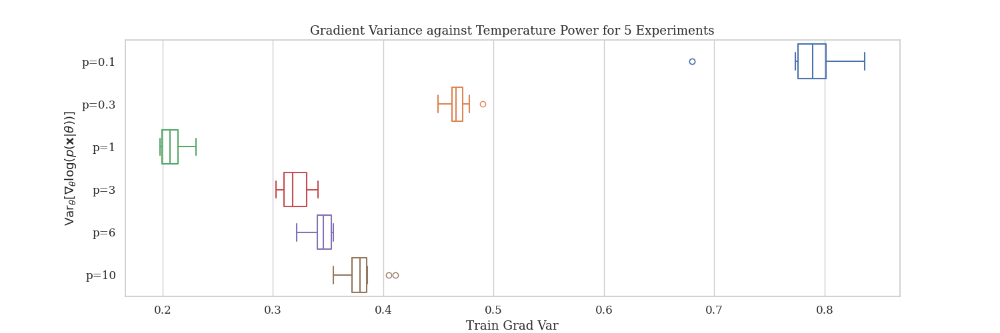
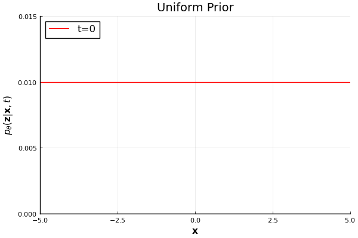
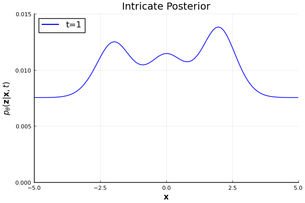
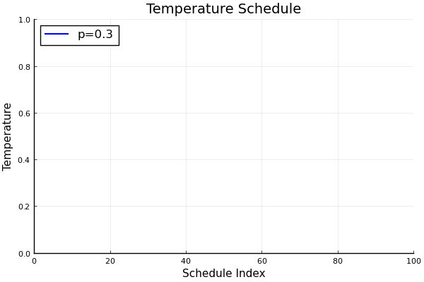
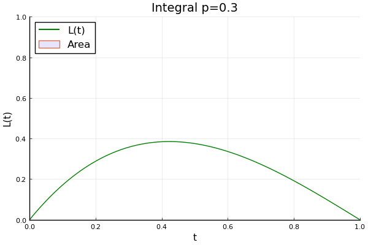

# JAX-Latent-Space-EBM-Prior
A JAX implementation of the Learning Latent Space Energy-Based Prior Model, presented by [Pang et al. (2020)](https://proceedings.neurips.cc/paper_files/paper/2020/file/fa3060edb66e6ff4507886f9912e1ab9-Paper.pdf). Thermodynamic Integration, presented by [Calderhead and Girolami (2009)](https://www.sciencedirect.com/science/article/pii/S0167947309002722),
 has also been implemented as a means of exerting control over learning gradient variance.

The [report](https://github.com/PritRaj1/JAX-ThermoEBM/blob/main/Shaping_the_Learning_Gradient_Distribution_with_Thermodynamic_Integration.pdf) is more informative than the readme and should be referred to for details regarding:

- The latent space energy-based prior model
- Thermodynamic Integration
- How image metrics were collected in an unbiased manner, (linear regression was used to extrapolate Kernel Inception Distance to an infinitely-sized sample set)
- The effect of other Thermodynamic Integration parameters on image fidelity
- Computational cost in terms of time and FLOPS

Thanks!

## To run

To get started, follow these steps:

1. Make sure you have Python version 3.9 or higher installed.
 
2. Install the required dependencies by running:

```bash
pip install -r requirements.txt
```

3. Edit the hyperparameters in the `hyperparams.ini` file according to your experiment setup.

4. Run the main experiment script `main.py` to gather CSV logs. You can do this by executing:

```bash
python main.py
```

## Report Abstract - Shaping the Learning Gradient Distribution with Thermodynamic Integration

The performances of deep generative models depend on the distributional characteristics of their learning gradients. Despite this, their exact influence remains poorly understood, and investigations into the topic are bounded by our limited ability to shape the learning gradient distribution. To address this, we propose leveraging Thermodynamic Integration as a means of robustly controlling the learning gradient variance. The method is subsequently applied to investigate the relationship between learning gradient variance and the fidelity of images generated by the latent space energy-based prior model, introduced by Pang et al. \cite{pang}, to reveal striking polynomial relationships between image fidelity and learning gradient variance.

## Does learning gradient variance matter?

Yes. Learning gradient variance is very important. It is reflective of the exploratory vs exploitative capacity of your neural network during training. It often has a deterministic form, (in theory):

```math  
\nabla _\theta \mathcal{L}(\theta, \mathbf{x}) = - \nabla _\theta \log(p_\theta(\mathbf{x}))
```

However, it has to be evaluated using stochastic approximation approaches, therefore in reality...

```math
\left[ \nabla_\theta \mathcal{L}(\theta, \mathbf{x}) \right] \quad \text{is a distribution!}
```

We argue that adopting a distributional standpoint regarding a neural network's learning process, and being able to shape the form of its learning gradient distribution are important steps towards improving optimisation efficiency, generalisation, and generative capacity. To demonstrate this, here are some artificially generated images, with their corresponding learning gradients captioned underneath:

<p align="center">

</p>
 
As you can see, increasing learning gradient variance improves image fidelity **until a minimum is achieved**, (so long as mode collapse has not occurred). Increasing further beyond this worsens image quality. Previous attempts at shaping the distribution of the learning gradient have sought or provided expressions to reduce or minimise variance, (see [Calderhead and Girolami (2009)](https://www.sciencedirect.com/science/article/pii/S0167947309002722) and [Faghri et al. (2007)](https://arxiv.org/abs/2007.04532)). This would make sense if the learning gradient had an analytic form, since minimising variance is akin to minimising error. However, instead...

```math
\left[ \nabla_\theta \mathcal{L}(\theta, \mathbf{x}) \right] \quad \text{is a distribution!}
```

This was one of the demonstrated findings of the report, which persisted across datasets:

<p align="center">


</p>

These plots are fairly nuanced and are covered in more depth in the report. However, the important takeaway is that **there is a striking relationship between image fidelity and learning gradient variance!** Minmising or maximising variance is **not necessarily the best thing to do**, and the relationships can be separated out into different regimes of operation.

As such, more focus needs to be placed on investigating the distributional characteristics of the learning gradient, which requires a means of arbitrarily shaping what it looks like, (rather than simply minimising or maximising its variance). We show that this can be accomplished using **Thermodynamic Integration**.  

## Thermodynamic Integration

Batch size is another means of controlling the learning gradient variance, however it's not robust. Below is an experiment I ran comprising 5 repetitions. Here, batch size was varied and the range of learning gradient variances achieved across the repetitions was plotted. For reference, this is contrasted below against a model incorporating Thermodynamic Integration with a fixed batch size, and different values for a particular hyperparameter, $p$. 

<p align="center">
  
  
</p>

Evidently, Thermodynamic Integration can achieve comparable variances to the model incorporating different batch sizes, except it achieves much greater consistency across repetitions. This means that learning gradient variance can be robustly tuned by varying $p$, which facilitates important investigations into the learning gradient variance!

### What is it?

Thermodynamic Integration alters the marginal likelihood evaluation, (which is used as the negated loss for maximum likelihood training - coded up [here](https://github.com/PritRaj1/JAX-ThermoEBM/tree/main/src/loss_computation)).

Below is the vanilla formulation used to evaluate the marginal likelihood in latent space modelling. It requires marginalising across the entire latent space:

```math
\log(p_\theta(\mathbf{x}))=\mathbb{E}_{p_\theta(\mathbf{z}|\mathbf{x})}\left[ \log(p_\theta(\mathbf{x},\mathbf{z})) \right]
```

The expectation above requires sampling from the Bayesian posterior distribution.

```math
p_\theta(\mathbf{z}|\mathbf{x})=\frac{p_\beta(\mathbf{x}|\mathbf{z})p_\alpha(\mathbf{z})}{\mathcal{Z}(\mathbf{x})}
```

Thermodynamic Integration replaces this marginal likelihood evaluation with the following integral, (derivation in [Calderhead and Girolami (2009)](https://www.sciencedirect.com/science/article/pii/S0167947309002722)):

```math
\log(p_\theta(\mathbf{x}))=\textcolor{red}{\int_0^1} \mathbb{E}_{p_\theta(\mathbf{z}|\mathbf{x},\textcolor{red}{t})}\left[ \log p_\beta(\mathbf{x}|\mathbf{z})\right] \, \textcolor{red}{dt}
```
This thermodynamic integral accumulates the expected likelihood, evaluated using samples from a special tempered distribution known as the power posterior distribution:

```math
p_\theta(\mathbf{z}|\mathbf{x},\textcolor{red}{t})=\frac{p_\beta(\mathbf{x}|\mathbf{z})^{\textcolor{red}{t}}p_\alpha(\mathbf{z})}{\mathcal{Z}(\mathbf{x}|\textcolor{red}{t})}
```

This is very important. At t=0, a sample from the power posterior is simply a sample from the prior distribution. At t=1, a sample from the power posterior is a sample from the true Bayesian posterior distribution. The prior distribution, with no features from the data space, is a much simpler distribution to explore and sample from than the Bayesian posterior distribution. Between t=0 and t=1, the integral progresses through increasingly intricate intermediary distributions:

<p align="center">
  
  
 
</p>

(Note: the above distributions are unnormalised)

Therefore, the exploratory vs exploitative nature of this marginal likelihood evaluation is directly influenced by the choice of temperature schedule adopted. The exact calculation of the thermodynamic integral remains practically infeasible, so instead the temperature schedule is instead discretised as:

```math
    \left\{t_1, t_2, \ldots t_{N_{\text{t}}}\right\}\, \text{for}\, t_i \in [0,1]
```

Here, $t_i$ denotes the tempering at the $i$ th index of the schedule, and $N_{\text{t}}$ is the number of temperatures. As such, the the marginal likelihood evaluation is approximated as:

```math
\log p_\theta(\mathbf{x}) \approx \frac{1}{2} \sum_i \Delta t_i (E_{i-1} + E_{i})
```

Where:

```math
\Delta t_i = t_i - t_{i-1}
```

```math
E_i = \mathbb{E}_{p_\theta(\mathbf{z}|\mathbf{x},t_i)} \left[ \log p_{\theta}(\mathbf{x}|\mathbf{z})\right]
```

This is equivalent to the trapezoidal rule for numerical integration. Now, you can't change the maths, but **you can change the discretisation** used to schedule the intermediary distributions that the integral steps through:

```math
t_i = \left(\frac{i}{N_{\text{t}}}\right)^p \quad \forall i \in \{1, \ldots, N_{\text{t}}\}
```

This is how p is incorporated. It's a power law schedule that **bends** the temperature schedule:

<p align="center">
  
</p>

This doesn't change the validity of the integral, the bounds are intact. However, **the approximation** - how the area under the curve has been estimated - has changed. We still aim to approximate the integral by accumulating bins under the $E_i$ function, however the width of these bins are no longer uniform when $p$ is altered:

<p align="center">
  
  
</p>

A large value of $p$ corresponds to a larger number of partitions or bins skewed towards the lower temperatures, i.e. the simpler intermediary distributions. A smaller value of $p$ corresponds to more partitions favouring the higher temperatures, i.e. the more intricate, data-informed distributions. Therefore, **the value of $p$ tips the balance between exploration and exploitation of the posterior distribution.**

This is how we parameterised the learning gradient variance. Different temperature schedules facilitate more or less variance to manifest in samples from the posterior distribution. This in turn manifests in the log-marginal likelihood, which reflects the learning gradient.

## Acknowledgements:

- Prof. Mark Girolami
- Mr. Justin Bunker
- [The Computational Statistics and Machine Learning Group](Computational Statistics and Machine Learning Group)
- Cambridge University Engineering Department
- Emmanuel College, the University of Cambridge


